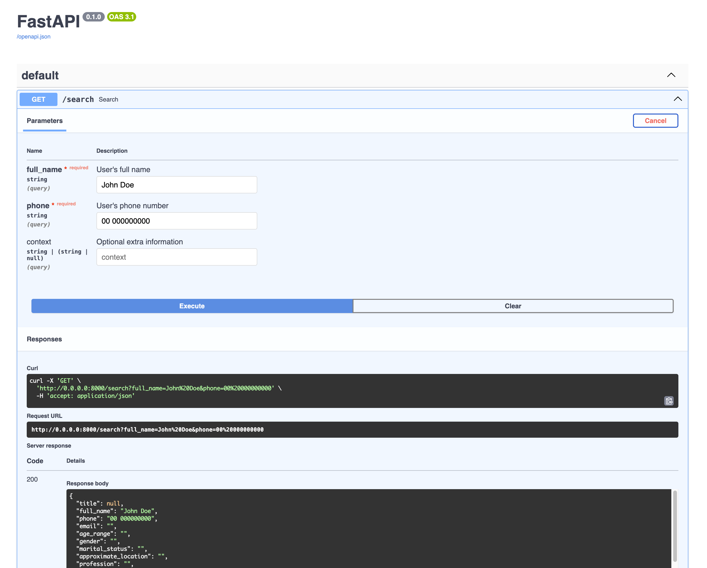

# **Deep Trace API**

A CrewAI-based project for searching, retrieving and enriching leads information.

---
## Agent Roles Summary

### Basic Info Agent
 - **Role:** Retrieves key LinkedIn profile details, such as profile photo, name, position, location, and profile link.
 - **Goal:** Finds the most relevant LinkedIn profile given a name and phone number, using context only for disambiguation.
 - **Backstory:** Specializes in extracting accurate LinkedIn information while ensuring only public data is retrieved.
 - **Custom Tool:** Uses LinkedInTool, a custom-built tool using Selenium that automates LinkedIn profile searches via web scraping.

### Deep Search Agent
 - **Role:** Conducts comprehensive web research on the client.
 - **Goal:** Aggregates publicly available information from social networks, company databases, legal records, and online mentions.
 - **Backstory:** An expert in deep web searches, using Google, Escavador, JusBrasil, and CNPJ databases to compile a complete profile.

### Image Fetch Agent
 - **Role:** Collects publicly available images from social media.
 - **Goal:** Finds relevant images with captions that reveal interests or lifestyle, ensuring only publicly shared content is retrieved.
 - **Backstory:** A specialist in tracking down social media images while respecting privacy settings.

### Image Analysis Agent
 - **Role:** Processes and interprets images to extract insights.
 - **Goal:** Uses AI to analyze photos, identifying age range, gender, clothing, environment, and objects.
 - **Backstory:** Trained in vision models and NLP, capable of linking visual elements to behavioral and lifestyle indicators.
 - **Custom Tool:** Uses ImageAnalysisTool, a specialized AI-driven tool for detailed image descriptions.

### Consolidation Agent
 - **Role:** Combines all data from other agents into a structured report.
 - **Goal:** Produces a comprehensive, reconciled JSON profile, resolving conflicts and adding inferred data (e.g., estimating age from educational milestones).
 - **Backstory:** Ensures data accuracy, resolves discrepancies, and creates an actionable final report.


## **🚀 How to Run This Project**
Ensure you have **Docker** installed and run:
```bash
docker-compose up
```


## Healthcheck - Verify If API Is Running

```bash
 curl -X 'GET' 'http://127.0.0.1:8000/health' -H 'accept: application/json'
```
If the API is running correctly, it should return:
```json
{"status": "OK"}
```

## Search for a person
Use the following cURL command to search for a person:
```bash
curl -X 'GET' 'http://0.0.0.0:8000/search?full_name=FULL_NAME&phone=PHONE_NUMBER&context=OPTIONAL_CONTEXT' -H 'accept: application/json'
```
example:
```bash
curl -X 'GET' \
  'http://0.0.0.0:8000/search?full_name=John%20Doe&phone=00%20000000000' \
  -H 'accept: application/json'
```
returns
```json
{
  "title": null,
  "full_name": "John Doe",
  "phone": "00 000000000",
  "email": "",
  "age_range": "",
  "gender": "",
  "marital_status": "",
  "approximate_location": "",
  "profession": "",
  "current_company": "",
  "social_media": {
    "linkedin": "",
    "instagram": "https://www.instagram.com/theejohndoe/?hl=en",
    "facebook": "https://www.facebook.com/theejohndoe/",
    "tiktok": "https://www.tiktok.com/@thejohndoeaccount",
    "github": "https://github.com/johndoe"
  },
  "societary_status": [
    {
      "company": "",
      "cnpj": "",
      "source": ""
    }
  ],
  "interests": [
    {
      "interest": "Physical sciences",
      "description": "John Doe has a background in physics.",
      "source": [
        "https://www.escavador.com/sobre/11337625/john-doe"
      ]
    }
  ],
  "mentions": [
    {
      "mention": "Research article on abortion",
      "description": "John Doe contributed to discussions around abortion laws.",
      "source": [
        "https://www.jusbrasil.com.br/artigos/o-aborto-e-o-direito-a-livre-escolha-da-mulher/250815036"
      ]
    }
  ],
  "legal_verification": [
    {
      "legal_mention": "Case reference involving John Doe",
      "description": "Involved in legal discussions regarding anonymity in blogging.",
      "source": [
        "https://www.jusbrasil.com.br/noticias/136985784/tribunal-nos-eua-decide-que-google-nao-precisa-identificar-blogueiro-anonimo"
      ]
    }
  ],
  "social_media_images": {
    "social_media_images": []
  },
  "observations_and_data_reconciliation": [
    {
      "observation": "Absence of age, gender, and marital status information.",
      "description": "The lack of certain personal details is noted, affecting the completeness of the profile.",
      "source": []
    }
  ]
}
```

Alternatively, open your browser and visit:\
- http://0.0.0.0:8000/docs# 
- Click on the **/search** endpoint.
- Click **"Try it out"**.
- Fill **full_name**, **phone**, and optionally **context** for more accurate results.
- Click **"Execute"** to send the request.




# Technologies Used
This project is built with: \
 - **FastAPI** - High-performance web framework for APIs
 - **Pydantic** - Data validation and settings management
 - **SQLAlchemy** - Database ORM
 - **Alembic** - Database migrations
 - **CrewAI** - AI-powered workflow automation


# Development Setup

## Create a Python Virtual Environment
```bash
brew install pyenv pyenv-virtualenv
pyenv install 3.12.5
pyenv virtualenv 3.12.5 deep_trace
pyenv activate deep_trace
```

## Install poetry
Poetry is used for dependency management. Install it with:
```bash
curl -sSL https://install.python-poetry.org | python3 -
```
For more details, visit [Poetry Installation Guide](https://python-poetry.org/docs/#installing-with-the-official-installer)

## Install Dependencies
Inside your project directory, run:
```bash
poetry install
```


## Run the API in Development Mode
Use FastAPI’s development server:
```bash
fastapi dev src/deep_trace/api.py
``` 

<br>
<br>

# Teste Prático - Desenvolvedor Python (Inteligência Artificial)

## Objetivo
Criar um sistema baseado em multi-agentes para buscar e consolidar informações públicas sobre um cliente a partir do nome e telefone. O sistema deve utilizar frameworks modernos de IA para agentes autônomos (CrewAI, LangChain, LangGraph, entre outros) e realizar deep search para obter informações relevantes em fontes públicas como redes sociais e bancos de dados online.

## Cenário
Somos uma imobiliária digital especializada na venda de apartamentos novos na planta. Captamos leads através do site (https://myside.com.br), onde clientes interessados preenchem formulários com nome e telefone. Nosso time de SDRs entra em contato para qualificação, mas atualmente realizamos buscas manuais no Google, o que é ineficiente.
Queremos um sistema que automatize essa pesquisa e gere um perfil detalhado do cliente, incluindo:

- Nome completo
- Idade ou faixa etária
- Gênero
- Estado civil
- Localização aproximada
- Profissão / Empresa atual
- Presença em redes sociais (Instagram, Facebook, LinkedIn)
- Interesses (ex: esportes, viagens, tecnologia, etc.)
- Possíveis menções notícias ou artigos relevantes
- Verificação de processos ou ações (ex: )
- Imagens do cliente em redes sociais
- Análise de imagens para inferir informações adicionais (ex: estilo de vida ambientes frequentes, hobbies) Requisitos Técnicos (sugestões)
- Linguagem: Python
- Frameworks para agentes: CrewAI, LangChain, LangGraph ou similar
- Web Scraping / APIs: Selenium, BeautifulSoup, Scrapy, SerpAPI, etc.
- Orquestração: Celery, RabbitMQ ou similar
- Banco de dados: PostgreSQL, MongoDB ou SQLite (para armazenar perfis gerados)
- Análise de imagens: utilizar qualquer LLM capaz de realizar análise de imagens.
- Entrega: Aplicativo FastAPI com endpoint para consulta (ex: <span style="color:green">/buscar?nome=Fulano&telefone=999999999</span>)

## Tarefas do Teste

1.  Criar um sistema multiagentes que distribua as buscas entre diferentes fontes públicas.

3.  Implementar um agente que busque informações básicas do cliente:

<ul>
<ol type="a">
<li>nome completo</li>
    <li>CPF</li>
    <li>Empresa atual</li>
    <li>Participação societária</l>
</ol>
</ul>

3.  Implementar um agente que seja capaz de iniciar uma transação PIX, usando o telefone como chave, a partir do site de um banco. Isso pode ser extremamente útil para coletar dados do cliente como Nome Completo e CPF.
 
4.  Criar um agente que faça deep search (busca aprofundada) sobre o cliente procurando tudo que possa encontrar sobre ele na internet:

<ul>
    <ol type="a">
        <li>notícias</li>
        <li>artigos</li>
        <li>entrevistas</li>
        <li>redes sociais</li>
            <ol type="i">
                <li>linkedin</li>
                <li>instagram</li>
                <li>facebook</li>
            </ol>
        <li>menções relevantes</li>
    </ol>
</ul>

5.  Criar um agente que busque imagens e legendas do cliente nas redes sociais (considerar que o cliente tem perfil aberto):

<ul>
    <ol type="a">
        <li>linkedin</li>
        <li>instagram</li>
        <li>facebook</li>
    </ol>
</ul>

6.  Criar um agente que processe imagens (e legendas) do cliente, analisando possíveis informações inferidas nas fotos:

<ul>
    <ol type="a">
    <li>padrão de vida</li>
    <li>hobbies</li>
    <li>filhos</li>
    <li>interesses</li>
</ol>
</ul>


7.  Consolidar os dados coletados e gerar um resumo estruturado.
   
<ul>
    <ol type="a">
        <li>incluir no resultado todas as imagens relevantes encontradas.</li>
    </ol>
</ul>

8.  Expor um endpoint REST para consulta.

OBS: A implementação de todos os agentes acima não é obrigatória, porém desejável.

## Critérios de Avaliação

- **Correção técnica:** O sistema deve ser funcional e fornecer informações relevantes.
- **Uso adequado de multiagentes:** Agentes especializados devem trabalhar de forma distribuída.
- **Eficácia da deep search:** Capacidade de coletar informações relevantes e confiáveis.
- **Qualidade da análise de imagens:** Capacidade de identificar informações relevantes a partir das fotos.
- **Boas práticas de código:** Estrutura limpa, modular e bem documentada.
- **Desempenho:** Respostas rápidas e eficiente uso de recursos.

## Entrega

O candidato deve fornecer:
- Repositório Git com o código fonte e README explicando a solução.
- Instruções de instalação e execução.
- (Opcional) Demonstração em vídeo ou deploy online.
